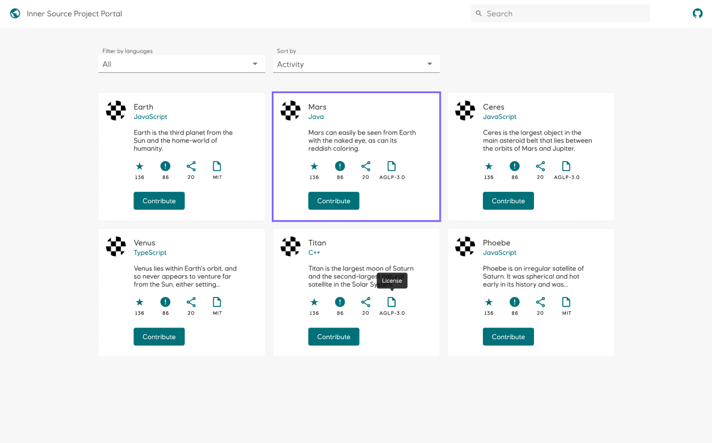

Equinor Open-Source Portal
=========================

Use this repo as a starting point to implement [the design][] for the [Equinor Open-Source Portal][]. 
Click the “Use this template” button to create a copy in the Equinor-Playground organisation, and prefix the new repo with your shortname, so for example `vnys-eds-opensource-portal`. 

Follow the instructions in <https://github.com/equinor/edc2021-eds-workshop>

Good luck :blush:

[the design]: https://www.figma.com/file/mZuhLRCnGFu13NeJJkuhD6/Design?node-id=1%3A162
[Equinor Open-Source Portal]: https://edc2021-eds-workshop.app.playground.radix.equinor.com
